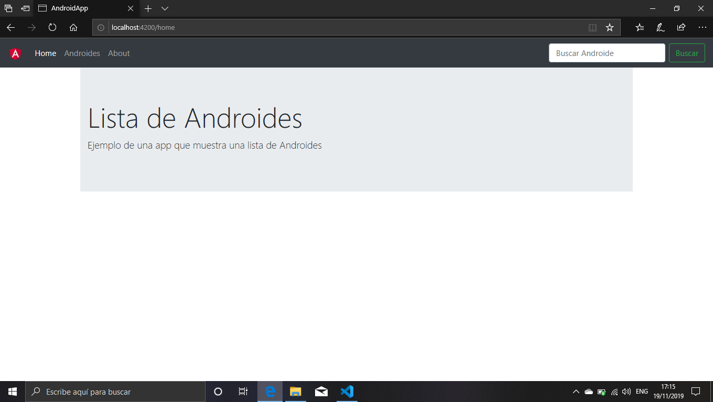
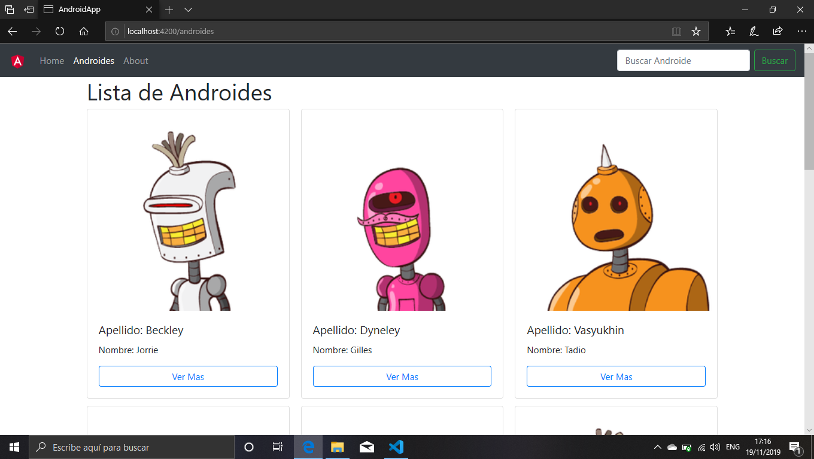
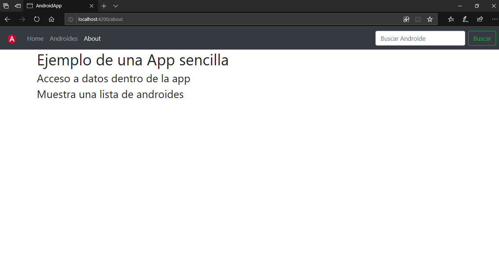
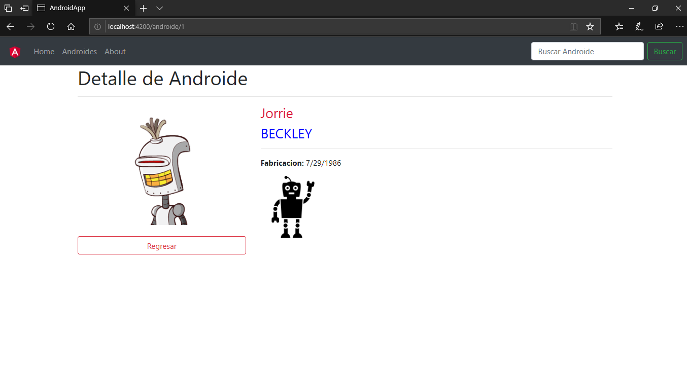

# Ejemplo de una App en Angular 
Este es un ejemplo como construir  una app  con angular. Describiré paso a paso de manera sencilla  adjuntándole el código necesario para que funcione. En este ejemplo quiero mostrar una app sencilla que nos permita un manejo simple de datos que se encuentran en el modulo de services

## 🛠️ Construido con :

* [Node.js](https://nodejs.org/en/) 
* [Angular](https://angular.io/) 
* [HTML5](https://developer.mozilla.org/es/docs/HTML/HTML5) 
* [Bootstrap](https://getbootstrap.com/) 
* [Visual Studio Code](https://code.visualstudio.com/)

## ✒️ Autor

**Sebastián Echazú** 

* [Facebook](https://www.facebook.com/sebastian.echazu.1)
* [Instagram](https://www.instagram.com/seba_storm)
* [Twitter](https://twitter.com/seba_storm)
* [Github](https://github.com/SebastianEchazu)


## 📄 Licencia 

Este proyecto está bajo la Licencia **Creative Commons** - mira el enlace a la [licencia](**Creative Commons** ) para detalles

## 🎁 Expresiones de Gratitud 

* Comenta a otros sobre este proyecto 📢
* Invita una cerveza 🍺 o un café ☕ al autor.  🤓. 

---
⌨️ con ❤️ por [Sebastian Echazu](https://github.com/SebastianEchazu) 😊

------

# Consideraciones antes de comenzar

Quiero aclarar que doy por descartado que en la pc esta instalado node.js o angular cli de todas formas en la sección **🛠️ Construido Con** están los enlaces para que puedan instalarlo

## 1 - Crear el Proyecto

para crear el proyecto de angular abrimos una consola de Windows (cmd) y ejecutamos el siguiente comando en la carpeta donde se ubicara el proyecto.
```bash
ng new AndroidApp
```
## 2 - Carpeta del proyecto

Esperamos que se termine de crear el proyecto y nos trasladamos a la carpeta del proyecto que acabamos de crear.
```bash
cd AndroidApp
```
## 3 - Corremos el proyecto 

Corremos el proyecto para verificar se creo de manera correcta. Crea un servidor de manera local que mantiene corriendo la app en paralelo al desarrollo. Esto no es muy útil al momento de desarrollar ya que nos permite visualizar los cambios de manera instantánea.

```bash
ng serve -o
```
## 4 - Creamos componentes

Abrimos de nuevo una consola ,nos aseguramos que estamos dentro de la carpeta del proyecto.  el comando para crear componentes es:

```bash
ng g c nombreComponente
```

Creamos 3 componentes:  home, about y el main donde listaremos los datos (utilizaremos para esta app como ejemplo el nombre "androides").

```bash
ng g c component/home --spec false
ng g c component/about --spec false
ng g c component/androides --spec false
```
Utilizo `--spec false` para eliminar la creación de archivo `spec.ts` que nos crea por defecto el framework (esto nos sirve para realizar test a los componentes).

## 5 - Creamos el Navbar 

Creamos el componente navbar. Este nos servirá para navegar dentro de nuestra aplicación.

```bash
ng g c component/shared/navbar --spec false
```
## 6 - Crear interface

Creamos el archivo interface androide. 

```bash
ng g i interface/androide 
```
## 7 - Modelo
En la interface de datos creamos nuestro modelo de datos para que podamos utilizarlo en nuestro proyecto.
```typescript
export interface Androide {
    id: number,
    nombre: string,
    apellido: string,
    amigo: boolean,
    fechaFabricacion: string,
    avatar: string
}
```
## 8 -  Bootstrap
Instalamos en nuestro proyecto Bootstrap. En el siguiente [link](https://getbootstrap.com/docs/4.4/getting-started/introduction/) les dejo en enlace para poder hacerlo según la documentación oficial. Para este ejemplo lo hago de la siguiente manera copiando la carpeta de Bootstrap en una carpeta que creamos llamada /styles y luego creando la referencia en el archivo styles.css
```css
@import './styles/bootstrap-4.3.1-dist/css/bootstrap.min.css';
```
## 9 - Navbar

Agregamos el siguiente código al archivo [navbar.component.html](https://github.com/Sebastian-Echazu-Angular/AndroidesApp/blob/master/src/app/components/shared/navbar/navbar.component.html) 
```html
<nav class="navbar navbar-expand-lg navbar-dark bg-dark">
    <a class="navbar-brand" href="#">  </a> <button class="navbar-toggler" 
		type="button" data-toggle="collapse" data-target="#navbarSupportedContent" 
		aria-controls="navbarSupportedContent" aria-expanded="false" aria-label="Toggle navigation"> 
			<span class="navbar-toggler-icon"></span> </button>
    <div class="collapse navbar-collapse" id="navbarSupportedContent">
        <ul class="navbar-nav mr-auto">
            <li class="nav-item" routerLinkActive="active"> <a class="nav-link" [routerLink]="['home']">Home </a> </li>
            <li class="nav-item" routerLinkActive="active"> <a class="nav-link" [routerLink]="['androides']">Androides</a> </li>
        </ul>
        <form class="form-inline my-2 my-lg-0"> <input class="form-control mr-sm-2" type="text" placeholder="Buscar Androide" #buscarTexto> <button (click) = "buscarAndroides(buscarTexto.value)" class="btn btn-outline-success my-2 my-sm-0" type="button">Buscar</button> 
        </form>
    </div>
</nav>
```
## 10 - Routing
agregamos al archivo [app-routing.module.ts](https://github.com/Sebastian-Echazu-Angular/AndroidesApp/blob/master/src/app/app-routing.module.ts) las rutas de nuestra app
```typescript
import { NgModule } from '@angular/core';
import { Routes, RouterModule } from '@angular/router';
import { HomeComponent } from './components/home/home.component';
import { AndroidesComponent } from './components/androides/androides.component';
import { AboutComponent } from './components/about/about.component';

const routes: Routes = [
  { path: 'home', component: HomeComponent },
  { path: 'androides', component: AndroidesComponent },
  { path: 'about', component: AboutComponent },
   //ruta de comodin en caso de no encontrar la direccion
  { path: '**', pathMatch: 'full', redirectTo: 'home' }
];

@NgModule({
  imports: [RouterModule.forRoot(routes)],
  exports: [RouterModule]
})
export class AppRoutingModule { }
```
no olvidar importar los componentes
## 11 - Componentes de Navegación
Agregamos al archivo [app.component.html](https://github.com/Sebastian-Echazu-Angular/AndroidesApp/blob/master/src/app/app.component.html) la estructura de la ruta
```html
<app-navbar></app-navbar>
<div class="container">
    <!--router-outlet asocia el presente archivo con mi configuración de rutas-->
    <router-outlet></router-outlet>
</div>
```
## 12 - Servicios
Creamos un servicio para poder utilizarlo en nuestro proyecto. El servicie es un archivo de typescript donde alojaremos los métodos que nos permiten el acceso a datos o cualquier otro servicio que nuestra app consuma
```bash
ng g s service/androides --spec false
```
## 13 - Datos de la app
Agregamos al servicio un conjunto de datos que vamos a utilizar en nuestra aplicación y agregamos un método que nos retorne la lista completa de datos.
```typescript
import { Injectable } from '@angular/core';
import { Androide } from '../interface/androide';

@Injectable({
  providedIn: 'root'
})
export class AndroidesService {

    
  private androides: Androide[] = [
    {
      id: 1,
      nombre: "Jorrie",
      apellido: "Beckley",
      amigo : true,
      fechaFabricacion: "7/29/1986",
      avatar: "https://robohash.org/voluptatumestsint.jpg?size=250x250&set=set1"
    },
    {
      id: 2,
      nombre: "Felic",
      apellido: "Roiz",
      amigo : false,
      fechaFabricacion: "6/22/1985",
      avatar: "https://robohash.org/magnamfugaminima.bmp?size=250x250&set=set1"
    },
    {
      id: 3,
      nombre: "Adelaida",
      apellido: "Clinnick",
      amigo : true,
      fechaFabricacion: "1/23/1976",
      avatar: "https://robohash.org/impeditquislaborum.bmp?size=250x250&set=set1"
    },
    {
      id: 4,
      nombre: "Pauline",
      apellido: "Coulter",
      amigo : false,
      fechaFabricacion: "6/25/1977",
      avatar: "https://robohash.org/repellatadvel.bmp?size=250x250&set=set1"
    },
    {
      id: 5,
      nombre: "Gilles",
      apellido: "Dyneley",
      amigo : true,
      fechaFabricacion: "4/4/1989",
      avatar: "https://robohash.org/rerumveniamsit.jpg?size=250x250&set=set1"
    },
    {
      id: 6,
      nombre: "Zebadiah",
      apellido: "Hayhoe",
      amigo : false,
      fechaFabricacion: "11/27/1986",
      avatar: "https://robohash.org/atinventoremaxime.bmp?size=250x250&set=set1"
    },
    {
      id: 7,
      nombre: "Lothaire",
      apellido: "Moreby",
      amigo : true,
      fechaFabricacion: "11/11/1980",
      avatar: "https://robohash.org/laborumvoluptatemet.bmp?size=250x250&set=set1"
    },
    {
      id: 8,
      nombre: "Karl",
      apellido: "Hagart",
      amigo : false,
      fechaFabricacion: "3/30/1985",
      avatar: "https://robohash.org/iureinut.jpg?size=250x250&set=set1"
    },
    {
      id: 9,
      nombre: "Tadio",
      apellido: "Vasyukhin",
      amigo : true,
      fechaFabricacion: "3/12/1971",
      avatar: "https://robohash.org/velitetsunt.png?size=250x250&set=set1"
    },
    {
      id: 10,
      nombre: "Steward",
      apellido: "de la Tremoille",
      amigo : false,
      fechaFabricacion: "7/11/1982",
      avatar: "https://robohash.org/quiadebitisvoluptate.bmp?size=250x250&set=set1"
    }
  ]
  constructor(){ console.log("servicio listo!!!"); }
  public getAndroides(): Androide[]{
    return this.androides;
  }
}

```
## 14 - Tarjeta
En el archivo  [androides.component.html](https://github.com/Sebastian-Echazu-Angular/AndroidesApp/blob/master/src/app/components/androides/androides.component.html) agregamos una la tarjeta que por intermedio de comando [@ngFor](https://angular.io/guide/displaying-data) nos permitirá  mostrar el conjunto de datos
```html
<h1>Lista de Androides</h1>
<div class="card-columns">
    <div class="card animated fadeIn fast" *ngFor="let androideAux of androides; let i = index">
        
        <div class="card-body">
            <h5 class="card-title">Apellido: {{androideAux.apellido}}</h5>
            <p class="card-text">Nombre: {{androideAux.nombre}}</p>
            <button (click)="verAndroide(androideAux.id)" type="button" class="btn btn-outline-primary btn-block">Ver Mas</button>
        </div>
    </div>
</div>
```
## 15 - Lógica de la información
En el archivo [androides.component.ts](https://github.com/Sebastian-Echazu-Angular/AndroidesApp/blob/master/src/app/components/androides/androides.component.ts) agregaremos el código necesario y una inyección del servicio que nos proveerá de los datos y métodos para ser mostrados
```typescript
import { Component, OnInit } from '@angular/core';
import { AndroidesService } from 'src/app/service/androides.service';

import { Router } from '@angular/router';
import { Androide } from 'src/app/interface/androide';

@Component({
  selector: 'app-androides',
  templateUrl: './androides.component.html',
  styleUrls: ['./androides.component.css']
})
export class AndroidesComponent implements OnInit {

  androides: Androide[] = [];

  constructor(private _androidesService:AndroidesService,private router:Router) { }

  ngOnInit() {
    this.androides= this._androideService.getAndroides();
    console.log(this.androides);
  }

  public verAndroide(idx:string){ this.router.navigate(['/androide', idx]) }

}
```
## 16 - Servicios
Agregamos a nuestro archivo [app.module.ts](https://github.com/Sebastian-Echazu-Angular/AndroidesApp/blob/master/src/app/app.module.ts) el service de nuestra app.
```typescript
import { BrowserModule } from '@angular/platform-browser';
import { NgModule } from '@angular/core';

import { AppRoutingModule } from './app-routing.module';
import { AppComponent } from './app.component';
import { HomeComponent } from './components/home/home.component';
import { AboutComponent } from './components/about/about.component';
import { AndroidesComponent } from './components/personas/personas.component';
import { NavbarComponent } from './components/shared/navbar/navbar.component';
//importamos el servicio 
import { PersonasService } from './service/personas.service';

@NgModule({
  declarations: [
    AppComponent,
    HomeComponent,
    AboutComponent,
    AndroidesComponent,
    NavbarComponent
  ],
  imports: [
    BrowserModule,
    AppRoutingModule
  ],
  //Agregamos el servicio a providers
  providers: [AndroidesService],
  bootstrap: [AppComponent]
})
export class AppModule { }
```

## 17 -  Home
Agregamos a [home.component.html](https://github.com/Sebastian-Echazu-Angular/AndroidesApp/blob/master/src/app/components/home/home.component.html) una plantilla de presentación de nuestra app
```html
<div class="jumbotron jumbotron-fluid">
    <div class="container">
        <h1 class="display-4">Lista de Androides</h1>
        <p class="lead">Ejemplo de una app que muestra una lista de Androides</p>
    </div>
</div>
```
## 18 - About
Agregamos a [about.component.html](https://github.com/Sebastian-Echazu-Angular/AndroidesApp/blob/master/src/app/components/about/about.component.html) una plantilla de información. 
```html
<h1 class="animated fadeIn fast">Ejemplo de una App sencilla</h1>
<h3 class="animated fadeIn">Acceso a datos dentro de la app</h3>
<h3 class="animated fadeIn">Muestra una lista de androides</h3>
```
## 19 - Css para About
Agregamos al archivo [about.component.ts](https://github.com/Sebastian-Echazu-Angular/AndroidesApp/blob/master/src/app/components/about/about.component.ts) animaciones para about.
```css
.animated {
    -webkit-animation-duration: 1s;
    animation-duration: 1s;
    -webkit-animation-fill-mode: both;
    animation-fill-mode: both;
}
.fast {
    -webkit-animation-duration: 0.4s;
    animation-duration: 0.4s;
    -webkit-animation-fill-mode: both;
    animation-fill-mode: both;
}
@keyframes fadeIn {
    from {
        opacity: 0;
    }
    to {
        opacity: 1;
    }
}
.fadeIn {
    animation-name: fadeIn;
}
```
## 20 - Imagen de navbar
 agregamos a la carpeta assets/img el archivo angular.png

## Home

## Androides

## About


# DETALLES
## 21 - Componente de detalles
agregamos un componente de detalles para poder detallar cada persona
```bash
ng g c components/androide --spec false
```
## 22 - Routing de detalles
agregamos al archivo de routing la pagina de detalles
```typescript
//importamos el componente persona
import { AndroideComponent } from './components/androide/androide.component';
//componente de persona asociado a un id
{ path: 'androide/:id',component:AndroideComponent},
```
## 23 Vista del componente Persona
agregamos el siguinte codigo a la pagina de androide .
``` html
<h1>Detalle de Androide </h1>
<hr>
<div class="row">
    <div class="col-md-4" style="text-align: center">
         <br><br>
        <a [routerLink]="['/androides']" class="btn btn-outline-danger btn-block">Regresar</a> </div>
    <div class="col-md-8">
        <h3 style="color: crimson">{{androide.nombre}}</h3>
        <h3 style="color: blue;"> {{androide.apellido | uppercase}}</h3>
        <hr>
        <p><b>Fabricacion:</b> {{androide.fechaFabricacion}}</p>
        <div>  </div>
    </div>
</div>
```
## 24 - Imagen Amistad
Agregamos a la carpeta assets/img el archivo amistad.png

## 25 - Logica de persona
Agrego al archivo personas.service.ts el metodo para mostrar equipo por id
``` typescript
public getAndroideXId(idx: number): Androide {
    for (let androide of this.androides) {
      if (androide.id == idx) {
        return androide;
      }
    }
  }
```
## 26 - Componente Androides

agregamos el metodo al componente de detalle para habilitar el boton de mostrar el quipo
``` typescript
public verPersona(idx: number) {
    this.router.navigate(['/persona', idx])
  }
```
## 27 - Logica Componente Androide

eliminamos el metodo oninit y instanciamos a nuestro service para obtener una persona
``` typescript
import { Component, OnInit } from '@angular/core';
import { Androide } from 'src/app/interface/androide';
import { ActivatedRoute } from '@angular/router';
import { AndroidesService } from 'src/app/service/androides.service';

@Component({
  selector: 'app-androide',
  templateUrl: './androide.component.html',
  styleUrls: ['./androide.component.css']
})
export class AndroideComponent {

  androide: Androide;

  constructor(private activatedRouted: ActivatedRoute, private _androidesService: AndroidesService) {
    this.activatedRouted.params.subscribe(params => {
      console.log(params['id'])
      this.androide = this._androidesService.getAndroideXId(params['id'])
    })
  }
}
```
# Pagina de Androide


## 29 - Componente buscador
agregamos el componente buscador
``` bash
ng g c components/buscador --spec false
```
## 30 - Modificar Service
Agregamos el metodo en service para que el componente pueda recibir un termino y asociarlo a un elemento de la coleccion
```typescript
public buscarAndroide(termino: string):Androide[] {
    let androideArr: Androide[] = [];
    termino = termino.toLowerCase();
    for(let androide of this.androides){
      let apellido = androide.apellido.toLowerCase();
      if (apellido.indexOf(termino) >= 0) {
        androideArr.push(androide);
      }
    }
   return androideArr;
  }
```
## 31 - Logica de Buscador
agregamos el codigo para que podamos asociar al elemento buscador una logica
```typescript
import { Component, OnInit } from '@angular/core';
import { Androide } from 'src/app/interface/androide';
import { ActivatedRoute, Router } from '@angular/router';
import { AndroidesService } from 'src/app/service/androides.service';

@Component({
  selector: 'app-buscador',
  templateUrl: './buscador.component.html',
  styleUrls: ['./buscador.component.css']
})
export class BuscadorComponent implements OnInit {

  androides: Androide[] = [];
  termino : string;

  constructor(private activatedRoute:ActivatedRoute, private _androidesService:AndroidesService,private router:Router) { }

  ngOnInit() {
    this.activatedRoute.params.subscribe(params=>{
      this.termino = params['termino'];
      this.androides = this._androidesService.buscarAndroide(params['termino']);
    });
  }
  public verAndroide(idx:number){ this.router.navigate(['/androide', idx]) }

}
```
## - 32 Vista de Buscador
agregamos el codigo logico del buscador
``` typescript
<h1>Buscando: {{termino}} </h1>
<hr>
<div class="row" *ngIf="androides.length == 0">
    <div class="col-md-12">
        <div class="alert alert-info" role="alert"> No existen resultados con el termino: {{termino}} </div>
    </div>
</div>
<div class="card-columns">
    <div class="card animated fadeIn fast" *ngFor="let androideAux of androides; let i = index">
        
        <div class="card-body">
            <h5 class="card-title">{{androideAux.nombre}}</h5>
            <p class="card-text">{{androideAux.apellido}}</p>
            <p class="card-text"> <small class="text-muted">{{androideAux.fechaFabricacion}}</small> </p>
            <button (click)="verAndroide(androideAux.id)" type="button" class="btn btn-outline-primary btn-block">Ver Mas</button>
        </div>
    </div>
</div>
```
## 33 - Modificamos el routing
agregamos al routing del buscador 
```typescript
import { BuscadorComponent } from './components/buscador/buscador.component';
//componente que nos permite buscar por nombre
{ path: 'buscar/:termino', component: BuscadorComponent },
```
## 34 - Modificamos Navbar
modificamos el componente de navbar para habilitar la accion de buscar
``` typescript
import { Component, OnInit } from '@angular/core';
import { Router } from '@angular/router';

@Component({
  selector: 'app-navbar',
  templateUrl: './navbar.component.html',
  styleUrls: ['./navbar.component.css']
})
export class NavbarComponent {

  constructor(private router: Router) { }

  buscarAndroides(textoBusqueda: string) {
    this.router.navigate(['/buscar', textoBusqueda]);
  }
}
```
# Captura del Componente de busqueda

